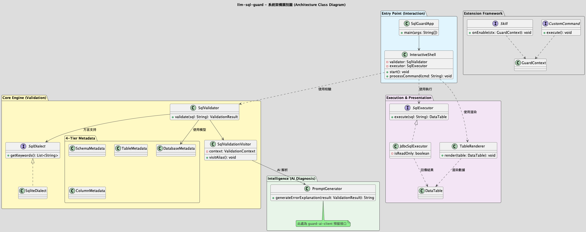
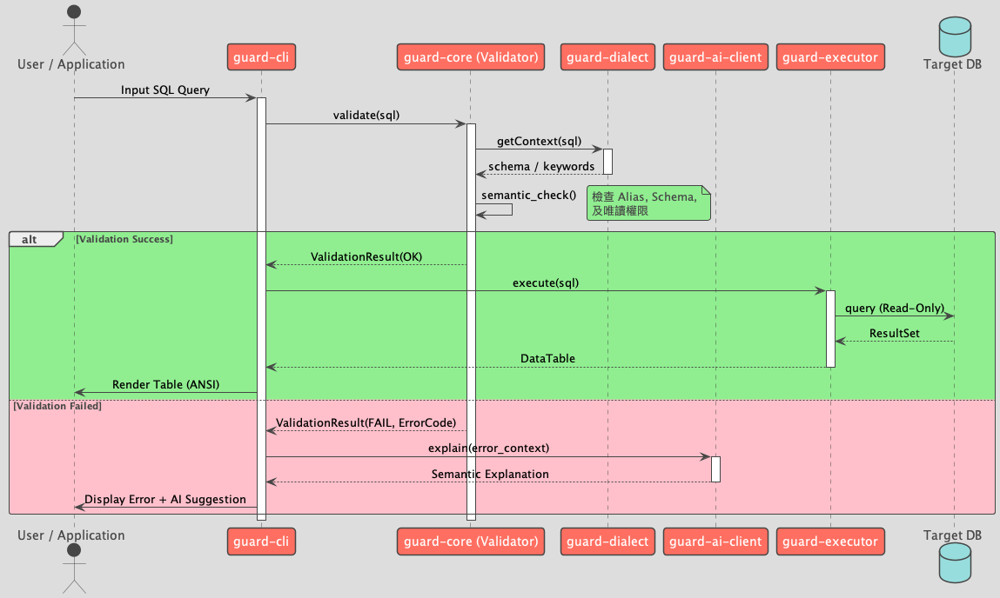

# llm-sql-guard 專業架構說明 (Architecture Documentation)

本文件依據 **Architecture Blueprint v1.0.0** 整理，定義了 llm-sql-guard 的五層解耦架構。

## 1. 系統架構圖 (Architecture Overview)

## 2. SQL 防護流程 (SQL Guard Lifecycle)

## 3. 架構設計核心決策 (ADR)
本專案的重大架構決策詳見 [adr/](adr/)。

1.  **核心安全優先 (Security Priority: Critical):**
    *   JdbcSqlExecutor 強制實作唯讀保護。

---
*Generated by Gemini Architect for llm-sql-guard Project.*
